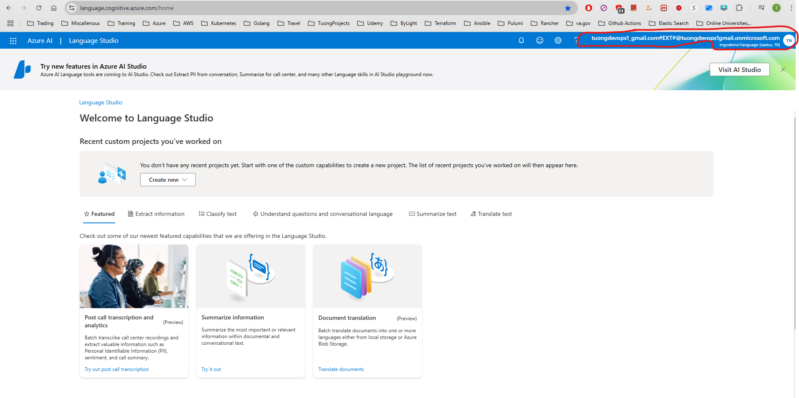
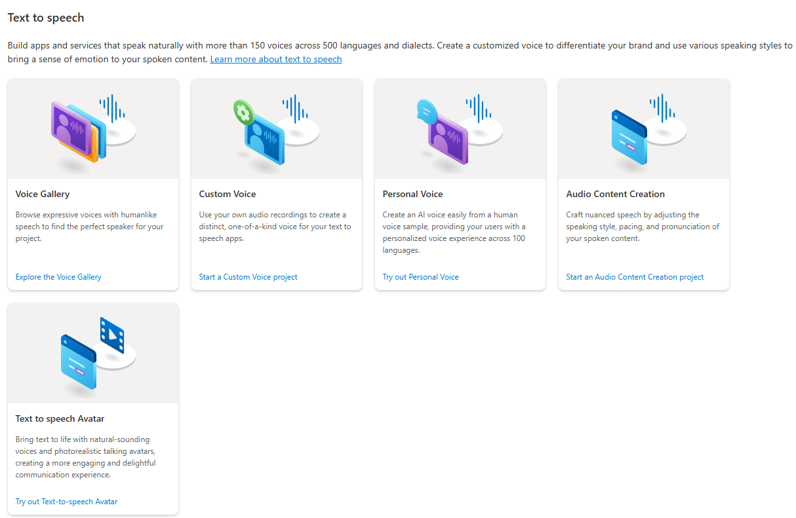
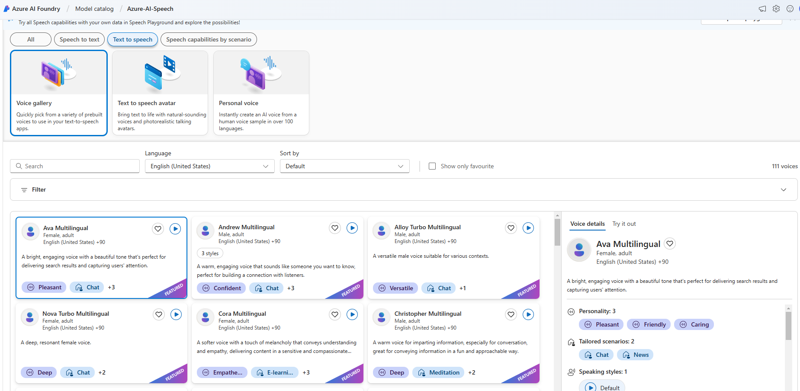
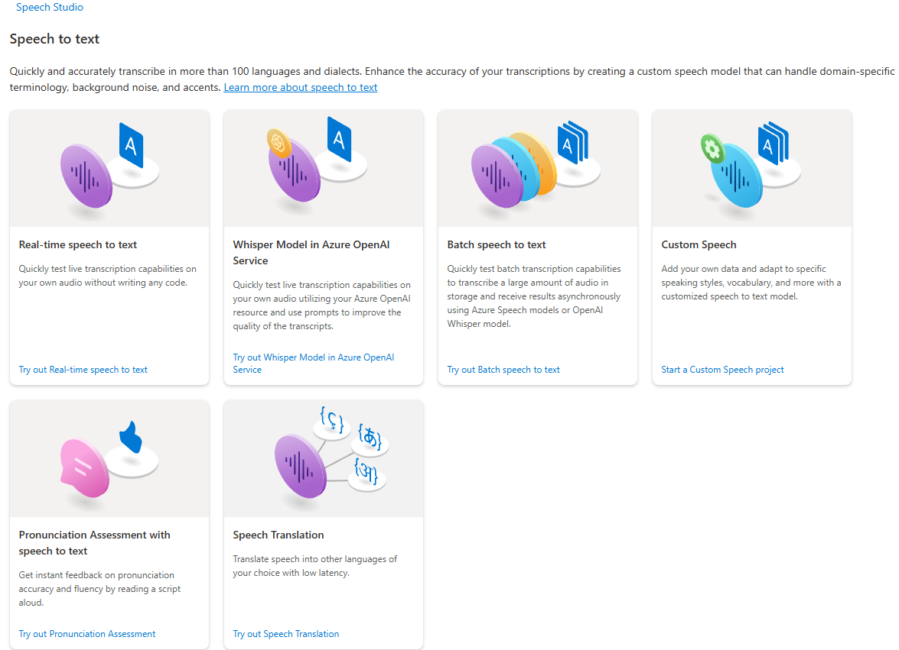
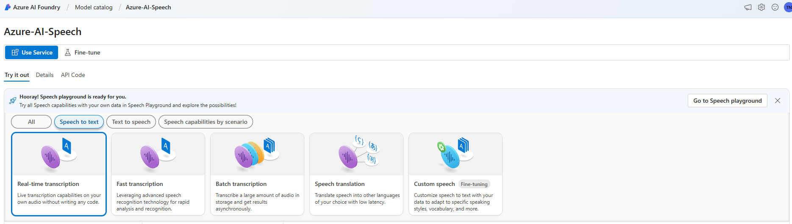
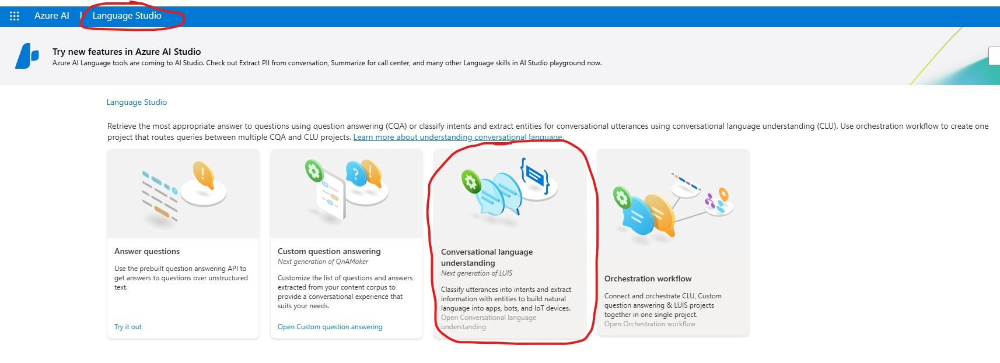

<h1 style="color:pink; font-family:cursive; font-weight:bold; text-align:center;">Azure AI Engineer Associate  Tuong Ngo</h1>

- **REST API Reference**: https://learn.microsoft.com/en-us/rest/api/aiservices/?view=rest-customvision-v3.4-preview

<h1 style="color:blue; font-family:cursive; font-weight:bold; text-align:left;">Plan, create and deploy and Azure AI Service</h1>

## Six Principles Should Guide AI Development
- Fairness
- Reliability and safety
- Privacy and security
- Inclusive
- Transparency
- Accountability
## Azure AI Services CI/CD
- Apply to Custom Models
  - Custom vision
  - Custom Speech
  - Conversation AI - bots
  - Custom Document Intelligence
- When creating a custom model, need to split data into `training data` and `testing data`
- When you have new or more `testing data`, the CI workflow recalculates the error rate for the new data
When you have new `training data`, the model is re-trained on that data -> basically a brand new data is created
  - You can rerun the new model under your test
  - If new model does **not** improve on the old model (`error rate`), then stop
  - If improves on the old ones (`error rate`), deploy it
    - May want to have manual approval so that teams are on standby for changes to production
    - Check out `Speech Services DevOps Template` for sample

## Azure AI Services Container Deployment - such as in K8s
- Reference: https://learn.microsoft.com/en-us/azure/ai-services/cognitive-services-container-support
- Can deploy **some** of AI Services in Containers to be run On-Premise. Some container services support offline use which are subjected to MSFT approval.
- AI Services are priced "per call" so that data for such billing is still collected/sent but your own data aren't sent to the internet to the cloud.

### Benefits of containerzed AI
- Immutable infrastructure: complete control of hardware running the container
- Control over data
- Control over model updates
- Portable infrastructure
- High throughput / low latency
- Scalability

### Decision Services that Support Containers
- Anomaly Detector

### Language Services that Support Containers
- LUIS
- Key phrase extraction
- Language detection
- Sentiment analysis
- Named entity recognition
- Summarization
- Translation

### Speech Services that Support Containers
- Speech to text
- Custom Speech to text
- Language identification

<h1 style="color:blue; font-family:cursive; font-weight:bold; text-align:left;">Manage, monitor, and secure an Azure AI service</h1>

## Configure diagnostic logging
- After creation of AI services resource group
- Go to that resource group -> Diagnostic settings
  - Audit logs
  - Request and Response Logs
  - Trace Logs
  - All Metrics (memory + CPU usages)
- If Destination is "Log Analycis workspace" -> Logs are sent to centralized "Monitor" workspace where we can perform various operation such as analysis over the logs
- It takes some time for the logs to be sent to Monitor's Logs|Metrics
- Monitor -> Metrics -> Choose scope (resource group of AI service)
  - Metrics include Successful Calls, RateLimit, Latency, Server Errors, etc...
- Monitor -> Logs -> Close out Queries page popped up -> Under New Query 1 tab ->  Pull out Tables listing -> Select scope -> Choose resource group of AI service
  - Query language used is `Kusto Query Language`
### Another way of turning on disagnostic logging
- Monitor -> Diagnotic settings -> Choose resouce that needs to have diagnostic enabled

## Managed Cost for Azure AI Services
- Reference: https://azure.microsoft.com/en-us/pricing/details/cognitive-services/
- Pricing is different from Regions, Currencies
- Calculator: https://azure.microsoft.com/en-us/pricing/details/cognitive-services/calculator
  - Choose AI Services -> Choose API -> Choose Tier
  

- To view cost: Home -> Cost Management + Billing -> Cost Management -> Cost Analysis -> Select scope -> pay as you go

  - Accumulated cost -> Can change scope to specific resource group or even at the subscription level
  - Accumulated cost -> Can view to `dailyCosts`, `monthlyCosts`, etc...
  - Accumulated cost -> Can change time period

## Manage Account Keys
- Resource group -> Resource of AI Service -> Resource Management ->  Key and Endpoint

- You'll need the key + the endpoint of the service to pass into your service code

## Protect account keys by using Azure Key Vault
- Key Vault is solution for the secure handling of secrets, including keys for AI Services
- Perform role assignment with role "Key Vault Administrator" to your self
- Go to `Secrets` tab -> Generate/Import -> Give the name to the Secret -> Copy content from AI Key and paste into the secret
- Modify the code to retrieve the key from here

### TODO
- Assignment: Official MS Learn Labs

<h1 style="color:blue; font-family:cursive; font-weight:bold; text-align:left;">Create Solutions For Content Delivery</h1>

### Azure AI Content Safety
Reference: https://contentsafety.cognitive.azure.com
- Monitor content generated by both foundation models and humans
- Defect and filter violence, hate, sexual and self-harm content
- Monitor text, images and multimodel content

## Text Moderation With Azure AI Content Safety
- Hate & Fairness
- Sexual
- Violence
- Self-harm

- Controller of this
  - Define severity thresholds for each category

## Image Moderation
- Hate & Fairness
- Sexual
- Violence
- Self-harm

<h1 style="color:blue; font-family:cursive; font-weight:bold; text-align:left;">Analyze images</h1>

- Resource: `Computer Vision`

## Azure AI Vision Services Overview
- Select visual features to meet image processing requirements
- Detect objects in images and generate image tags
- Include image analysis features in an image processing request
- Interpret image processing responses
- Extract text from images using Azure AI Vision
- Convert handwritten text using Azure AI Vision

## Image analysis
- API Version v4.0:  `azure.ai.vision.imageanalysis`
  - Read text
  - Captions
  - Dense captions
  - Tags
  - Object detection
  - Custom image classification / object detection
  - People
  - Smart crop
- Image Requirement v4.0:
  - JPG, PNG, GIF, BMP, WEBP, ICO, TIFF or MPO
  - Less than 20MB
  - Greater than 50x50 pixels
  - Less than 10000 x 1000 pixcels for OCR

## Detect Objects & Generate Tags
- Difference between Objects and Tags
  - Objects are actual physical items seen, provides their locations, identifies relationships and repetitions
  - Tags include both items seen and theme, i.e. a person jumping with a skateboard can have tags generated with: sport, street stunts, balance, skateboarding, ...
- Both Objects & Tags are both generated with % of confidence
- You can change the level of confidence to have objects & tags with higher confidence level to show up in a result

## Interpret image processing reponses
- API Reference: https://learn.microsoft.com/en-us/azure/ai-services/computer-vision/how-to/call-analyze-image-40?pivots=programming-language-rest-api
- Can generate caption, tags and object from an image via azure-ai-vision-imageanalysis python package code
- Multiple functions/calls are used, each incur a charge
- Refer to image_analysis.py file in azure-labs.git Tuong private repo

## Extract text from images using Azure AI Vision
- API Reference: https://learn.microsoft.com/en-us/azure/ai-services/computer-vision/how-to/call-read-api
- Use the Read API to extract printed and handwritten text in supported languages from images, PDFs, and TIFF files. The optical character recognition (OCR) capability supports both images and documents with mixed languages, and doesn't require specifying the language.
- Refer to image_analysis.py file in azure-labs.git Tuong private repo

<h1 style="color:blue; font-family:cursive; font-weight:bold; text-align:left;">Implement custom computer vision models</h1>

- Resource: `Custom Vision`

- **Important**: Only East US, West US 2, support Computer Solution at the time of writing

## Choose between image classification and object detection models
- `Custom vision service` enables you to create and train personalized models by assigning your own labels for image recognition.
  - `Image Classification`: Assigns labels to entire images
    - Ideal for categorizing photos into predefined classes
  - `Object detection`: Identifies and locates objects within images
    - Suitable for scenarios where the location of the object is important

## Creating, Training, Using Custom Image Model via Custom Vision
- Step by step handon for building, training, prediction consumption of `model customization`: https://learn.microsoft.com/en-us/azure/ai-services/Custom-Vision-Service/getting-started-build-a-classifiermodel-customization?tabs=studio
- Build programatically with Go [**outdated**]: https://learn.microsoft.com/en-us/azure/ai-services/custom-vision-service/quickstarts/image-classification?tabs=windows%2Cvisual-studio&pivots=programming-language-go
  - Custom Vision home to obtain settings of resources: https://www.customvision.ai/
- REST API Reference: https://learn.microsoft.com/en-us/rest/api/custom-vision/?view=rest-customvision-v3.4-preview

- Run `go run sample.go` under `azure_labs.git/custom_vision` from Tuong private repo

- Other API resources:
  - [API for creating project](https://learn.microsoft.com/en-us/rest/api/customvision/create-project/create-project?view=rest-customvision-v3.4-preview&tabs=HTTP)
  - [Getting project](https://learn.microsoft.com/en-us/rest/api/customvision/get-projects/get-projects?view=rest-customvision-v3.4-preview&tabs=HTTP)
  - [Train](https://learn.microsoft.com/en-us/rest/api/customvision/train-project/train-project?view=rest-customvision-v3.4-preview&tabs=HTTP)
  - [Publishing iteration](https://learn.microsoft.com/en-us/rest/api/customvision/publish-iteration/publish-iteration?view=rest-customvision-v3.4-preview&tabs=HTTP)
  - [Test image](https://learn.microsoft.com/en-us/rest/api/customvision/quick-test-image/quick-test-image?view=rest-customvision-v3.4-preview&tabs=HTTP)
  - [Query prediction](https://learn.microsoft.com/en-us/rest/api/customvision/query-predictions/query-predictions?view=rest-customvision-v3.4-preview&tabs=HTTP)
  - [Creating images from files](https://learn.microsoft.com/en-us/rest/api/customvision/create-images-from-files/create-images-from-files?view=rest-customvision-v3.4-preview&tabs=HTTP)

<h1 style="color:blue; font-family:cursive; font-weight:bold; text-align:left;">Analyze Videos</h1>

- Resource: `Computer Vision`

## Use Azure AI Video Indexer to extract insights
- Extract `insights` from videos
  - Transcripts
  - OCR elements
  - Faces
  - Topics
  - Audio effects detection
  - Text-basd emotion detection
  - and more...

## Use Azure AI Vision Spacial Analysis to detect presence and movement
- Examining the objects in the video and the relationship with each other
- Monitor people's presence and movements in video streams
- `Video Retrieval` of parts of videos that fits query description and `Summary` of videos
- Detect when people cross a line
- Detect when people enter/exit a zone
- Monitor social distancing

### Video Retrieval API Resources
- [API How-To](https://learn.microsoft.com/en-us/azure/ai-services/computer-vision/how-to/video-retrieval)
- [REST API Reference](https://learn.microsoft.com/en-us/azure/ai-services/computer-vision/reference-video-search)
- **Note**: Can't use the service nor its APIs unless you go with paid account

<h1 style="color:Red; font-family:cursive; font-weight:bold; text-align:left;">Implement Natural Language Processing Solutions</h1>

<h2 style="color:Green; font-family:cursive; font-weight:bold; text-align:left;">Language Service</h2>
- [Language Studio](https://language.cognitive.azure.com/home)
- **Important**: Make sure you invite an external account in `Microsoft Entra ID` send invite to another account and use that account to signin with your domain `#EXT@XXXXX.onmicrosoft.com` instead of your root personal email account. You'll need to accept invite from your personal account, then change password by `Forget password` option.

<h3 style="color:blue; font-family:cursive; font-weight:bold; text-align:left;">Analyze Text</h3>

## Key Phrase Extraction

- Resource: `Language`
- [REST API Reference](https://learn.microsoft.com/en-us/rest/api/language/text-analysis-runtime/analyze-text?view=rest-language-2024-11-01&tabs=HTTP)

- Identifies the main concepts and phrases from text, providing insights into its primary themes and topics
- 3 ways to use:
  - Language Studio
  - REST API
  - Container

- The more text provided, the better extraction of key phases such as topics, themes, etc...
- Use `key phrase extraction` to quickly identify the main concepts in text. For example, in the text "The food was delicious and the staff were wonderful.", `key phrase extraction` will return the main topics: "food" and "wonderful staff".

## Entity linking

- Resource: `Language`
- [REST API Reference](https://learn.microsoft.com/en-us/rest/api/language/text-analysis-runtime/analyze-text?view=rest-language-2024-11-01&tabs=HTTP)

- `Entity linking` identifies and disambiguates the identity of entities found in text. For example, in the sentence "We went to Seattle last week.", the word "Seattle" would be identified, with a link to more information on Wikipedia.

## Named Entity Recognition (NER)

- Resource: `Language`
- [REST API Reference](https://learn.microsoft.com/en-us/rest/api/language/text-analysis-runtime/analyze-text?view=rest-language-2024-11-01&tabs=HTTP)

- The `NER` feature can identify and categorize entities in unstructured text.
- **For example**: people, places, organizations, and quantities. The prebuilt NER feature has a pre-set list of recognized entities. The custom NER feature allows you to train the model to recognize specialized entities specific to your use case.

## Text Analytics for Health

- Resource: `Language`
- [REST API Reference](https://learn.microsoft.com/en-us/rest/api/language/text-analysis-runtime/analyze-text?view=rest-language-2024-11-01&tabs=HTTP)

- `Text Analytics for health` is a cloud-based API service that applies machine-learning intelligence to extract and label relevant medical information from a variety of unstructured texts such as doctor's notes, discharge summaries, clinical documents, and electronic health records.
- **Usage scenarios**:
  - Assisting and automating the processing of medical documents by proper medical coding to ensure accurate care and billing.
  - Increasing the efficiency of analyzing healthcare data to help drive the success of value-based care models similar to Medicare.
  - Minimizing healthcare provider effort by automating the aggregation of key patient data for trend and pattern monitoring.
  - Facilitating and supporting the adoption of HL7 standards for improved exchange, integration, sharing, retrieval, and delivery of electronic health information in all healthcare services.

## Custom Named Entity Recognition (NER)

- Resource: `Language`
- [REST API Reference](https://learn.microsoft.com/en-us/rest/api/language/text-analysis-runtime/analyze-text?view=rest-language-2024-11-01&tabs=HTTP)

- `Custom NER` is a cloud-based API service that applies machine-learning intelligence to enable you to build custom models for custom named entity recognition tasks.
- `Custom NER` enables users to build custom AI models to extract domain-specific entities from unstructured text, such as contracts or financial documents.
- By creating a `Custom NER project`, developers can iteratively label data, train, evaluate, and improve model performance before making it available for consumption. The quality of the labeled data greatly impacts model performance.
- To simplify building and customizing your model, the service offers a custom web portal that can be accessed through the Language studio.
- **Example usage scenarios**:
  - **Information extraction**: Automate data extraction from complex, unstructured text sources like bank statements and legal agreements.
  - **Knowledge mining**: Enhance search experiences by extracting relevant entities from text to enrich indexing.
  - **Audit and compliance**: Automate the review of long text files to enforce compliance policies and set up business rules.
- **Project development lifecycle**:
  - Define your schema: Identify the entities you want extracted.
  - Label your data: Label precisely, consistently, and completely.
  - Train the model: Your model learns from your labeled data.
  - View the model's performance: Evaluate and improve the model.
  - Deploy the model: Make it available for use via the Analyze API.
  - Extract entities: Use your custom models for entity extraction tasks.

- **TO-DO**:
  - Work on trained Custom `Name Entities Recognition` with REST API
  - [Create custom NER project REST API](https://learn.microsoft.com/en-us/azure/ai-services/language-service/custom-named-entity-recognition/how-to/create-project?tabs=portal%2Crest-api)

<h2 style="color:Green; font-family:cursive; font-weight:bold; text-align:left;">Speech Service</h2>

- Resource: `Speech`
- [Speech Studio](https://speech.microsoft.com/portal): Switching to [Azure AI Foundry](https://ai.azure.com/) soon

## Text To Speech

-  [Text To Speech Quick Start](https://learn.microsoft.com/en-us/azure/ai-services/speech-service/get-started-text-to-speech?tabs=windows%2Cterminal&pivots=programming-language-rest)
- [Text To Speech REST API](https://learn.microsoft.com/en-us/azure/ai-services/speech-service/rest-text-to-speech?tabs=streaming)
  - **Note**: Can use `Ocp-Apim-Subscription-Key` to exchange for a `Authorization` token which last for 10m or use `Ocp-Apim-Subscription-Key` throughout
- [Get Token for Text To Speech REST API](https://learn.microsoft.com/en-gb/azure/ai-services/speech-service/rest-text-to-speech?tabs=streaming#authentication)

- `prosody`: The patterns of stress and intonation in spoken language
- `Visemes`: Visemes are the key poses in observed speech, including the position of the lips, jaw, and tongue in producing a particular phoneme
- **Features**:
  - Prebuilt neural voice (called Neural on the pricing page): Highly natural out-of-the-box voices.
  - Custom neural voice (called Custom Neural on the pricing page): Easy-to-use self-service for creating a natural brand voice, with limited access for responsible use.

- Techniques for natual voice:
  - `Real-time speech synthesis`: Use the Speech SDK or [Text To Speech REST API](https://learn.microsoft.com/en-us/azure/ai-services/speech-service/get-started-text-to-speech?tabs=windows%2Cterminal&pivots=programming-language-rest) to convert text to speech by using prebuilt neural voices or custom neural voices.
  - `Asynchronous synthesis of long audio`: Use the [batch synthesis API](https://learn.microsoft.com/en-us/azure/ai-services/speech-service/batch-synthesis) to asynchronously synthesize text to speech files longer than 10 minutes (for example, audio books or lectures). Unlike synthesis performed via the Speech SDK or Speech to text REST API, responses aren't returned in real-time. The expectation is that requests are sent asynchronously, responses are polled for, and synthesized audio is downloaded when the service makes it available.
  - [Prebuilt neural voices](https://learn.microsoft.com/en-us/azure/ai-services/speech-service/language-support?tabs=tts): Each prebuilt neural voice model is available at 24 kHz and high-fidelity 48 kHz.
    - Make interactions with chatbots and voice assistants more natural and engaging.
    - Convert digital texts such as e-books into audiobooks.
    - Enhance in-car navigation systems.
- [Custom voice](https://learn.microsoft.com/en-gb/rest/api/aiservices/speechapi/operation-groups?view=rest-aiservices-speechapi-2024-02-01-preview):
  - You can train custom voice which requires Azure approval for limited use

## Speech To Text

Azure AI Speech service offers advanced speech-to-text capabilities, supporting both real-time and batch transcription for converting audio streams into text.

#### Core Features:
  - **Real-time transcription**: Instant transcription with intermediate results for live audio inputs.
  - **Fast transcription**: Synchronous output for quick transcription of audio recordings.
  - **Batch transcription**: Efficient processing for large volumes of prerecorded audio.
  - **Custom speech**: Enhanced accuracy for specific domains and conditions.

#### Real-time Speech to Text:
  - **Applications**: Live meeting transcriptions, captions, diarization, pronunciation assessment, call center assistance, dictation, and voice agents.

#### Fast Transcription:
  - **Applications**: Quick transcription of audio/video files, video translation.

#### Batch Transcription:
  - **Applications**: Transcriptions for prerecorded audio, contact center analytics, diarization.

#### Custom Speech:
- **Applications**: Tailoring models for domain-specific vocabulary and specific audio conditions.

#### Usage Examples:
  - **Live meeting transcriptions**: Real-time captions for webinars.
  - **Customer service**: Real-time transcriptions for call centers.
  - **Video subtitling**: Quick generation of subtitles.
  - **Educational tools**: Transcriptions for video lectures.
  - **Healthcare documentation**: Real-time dictation for patient consultations.
  - **Media and entertainment**: Subtitles for video archives.
  - **Market research**: Transcription of audio feedback for analysis.

## Speech Synthesis Markup Language (SSML) Overview

### What is SSML?
Speech Synthesis Markup Language (SSML) is an **XML-based markup language** that enhances text-to-speech (TTS) by allowing fine-tuned control over **pitch, pronunciation, speaking rate, volume**, and other speech attributes. It provides greater flexibility compared to plain text input.

> **Tip**: Use the [Voice Gallery](https://speech.microsoft.com/portal) to hear different voice styles and pitches.

### Use Case Scenarios
SSML enables various customizations for **speech output**:

- **Text Structure Definition**: Define paragraphs, sentences, breaks, pauses, or silence.
- **Event Tags**: Embed bookmarks or visemes (visual phoneme representations).
- **Voice Customization**: Choose voice, language, style, and role. Use multiple voices in a single document.
- **Speech Characteristics**: Adjust **emphasis, speaking rate, pitch, and volume**.
- **Pronunciation Control**: Use phonemes and custom lexicons to refine pronunciation.
- **Pre-recorded Audio Insertion**: Add sound effects or music within speech output.

### Ways to Work with SSML
Several tools support SSML for **speech synthesis**:

1. **Speech Studio (Audio Content Creation Tool)**:
   - Allows authoring plain text and SSML.
   - Provides audio previews for adjustments.
   - [Learn More](https://learn.microsoft.com/en-us/azure/ai-services/speech-service/speech-synthesis-markup)

2. **Batch Synthesis API**:
   - Accepts SSML as input via the `inputs` property.

3. **Speech CLI (`spx synthesize --ssml`)**:
   - Converts SSML into speech via command-line.

4. **Speech SDK**:
   - Supports SSML through the `speak` method in various programming languages.

## Intent Recognition & Pattern Matching

- Resource:  [CLU](https://learn.microsoft.com/en-us/azure/ai-services/language-service/conversational-language-understanding/overview)
> <h2 style="color:Red; font-family:cursive; font-weight:bold; text-align:left;">⚠ LUIS will be retired on October 1, 2025</h2>
> **As of April 1, 2023, new LUIS resources cannot be created.**
> **Migrate LUIS applications to CLU for continued support and multilingual capabilities.**

### What is Intent Recognition?
Intent recognition determines what a user wants to do based on speech or text input. It enables applications to interpret commands like **"book a flight"**, **"turn on the lamp"**, or **"check the weather"**. There are two primary approaches:

#### **Pattern Matching**
- Uses strict rules to recognize intents based on **exact phrases**.
- Best for **predictable** speech patterns (e.g., **"Go to floor seven"**).
- Implemented via **Speech SDK**, works **offline**.
- Ideal for **controlled environments** where specific phrases trigger actions.

### **Conversational Language Understanding (CLU)**
- Uses **machine learning** to interpret **intent** and extract **entities** from natural language.
- Requires both **Speech** and **Language** resources in Azure.
- Best for **dynamic, multilingual, and complex inputs**.

### **Pattern Matching vs. Exact Phrases**
- **Exact Phrase**: Must match **word-for-word**.
- **Pattern Matching**: Uses `{}` placeholders for **entities** (e.g., **"Take me to floor {floorName}"**).

#### **Types of Entities**
- **Any Entity**: Matches any text input in that slot.
- **List Entity**: Predefined values, with **Strict** (must match) or **Fuzzy** (accepts variations).
- **Prebuilt Integer**: Only recognizes **numeric values**.
- **Entity Roles**: Differentiates similar values (e.g., `{city:from}` and `{city:destination}`).

### **Grouping Required & Optional Words**
- **Required (`()`)**: Must be in the phrase.
- **Optional (`[]`)**: Can be omitted.
  - Example: `"(Bring | Take) me [to | the] {floorName} [please]"`.

### **When to Use What?**
| Feature | Pattern Matching | CLU |
|---------|----------------|-----|
| **Strict input control** | ✅ Yes | ❌ No |
| **Flexible language understanding** | ❌ No | ✅ Yes |
| **Offline use** | ✅ Yes | ❌ No |
| **Multi-language support** | ❌ Limited | ✅ Yes |
| **Machine Learning-based** | ❌ No | ✅ Yes |

## **Keyword Recognition**

**Keyword recognition** (or **keyword spotting**) detects a specific **word or phrase** within audio, commonly used for **voice activation** (e.g., "Hey Cortana"). It acts as a **privacy boundary**, ensuring only relevant user audio is processed.

### **Multi-Stage System**
- **Edge and cloud processing**: Audio is only processed further if prior stages detect the keyword.
- **Accuracy metrics**:
  - **Correct Accept Rate** (true positive) – Keyword correctly detected.
  - **False Accept Rate** (false positive) – Non-keyword mistakenly recognized.

### **Custom Keyword for On-Device Models**
- **Speech Studio** allows generating **custom keyword models** for local execution.
- **Two model types**:
  - **Basic** – Fast prototyping, lower accuracy.
  - **Advanced** – Trained with simulated data for improved accuracy (up to 48-hour processing).

- **Pronunciation Selection**:
  - Users **select correct variations** for better accuracy.
  - More pronunciations = **higher false accepts**.
  - Fewer pronunciations = **lower correct accepts**.

### **Keyword Verification**
- **Cloud-based verification** **reduces false accepts** using robust models.
- **Parallel Processing with Speech-to-Text (STT)**:
  - No extra **latency** for STT results.
  - Ensures **keyword is prefixed** in recognized text.
  - Increases **pause tolerance** (up to 5s) after keyword before terminating speech input.

### **Keyword Verification Responses**
- **Accepted** – Keyword confirmed.
- **Rejected** – Keyword not detected (higher latency due to extended processing).

- **Default processing limit**: 2 seconds of audio.
- **If keyword isn't found**, service times out and returns **rejected**.

### **Speech SDK Integration**
- **Automatically integrates**:
  - On-device keyword models.
  - Keyword verification.
  - Speech-to-text.

- **Two scenarios**:
  - **End-to-end keyword recognition with STT** – Full pipeline for connected devices.
  - **Offline keyword recognition** – On-device processing without cloud dependency.

<h2 style="color:Green; font-family:cursive; font-weight:bold; text-align:left;">Translator Service</h2>

## **Azure Text Translation**

Azure **Text Translation** is a cloud-based **REST API** feature of the **Translator service** that uses **neural machine translation (NMT)** for **real-time, accurate** text translation across multiple languages.

### **Core Features**
- **Languages API** – Retrieves supported languages for **Translation, Transliteration, and Dictionary Lookup** (No authentication required).
- **Translate API** – Converts **single-source text** into **multiple target languages** in a single request.
- **Transliterate API** – Converts **characters from one script** to another within the same language.
- **Detect API** – Identifies the source language and determines **text translation compatibility**.
- **Dictionary Lookup API** – Provides **equivalent words** for a source term in the target language.
- **Dictionary Example API** – Returns **grammatical structure and contextual examples** for word usage.

> **Note**: Translation, Transliteration, and Language Detection **can be performed in a single API call**.

## **Azure Document Translation**

Azure **Document Translation** is a cloud-based machine translation feature of the **Azure AI Translator service**. It allows you to translate multiple and complex documents across all supported languages and dialects while preserving the original document structure and data format. The Document Translation API supports two translation processes:

### **Asynchronous Batch Translation**
- Supports the processing of multiple documents and large files.
- Requires an Azure Blob storage account with storage containers for your source and translated documents.

### **Synchronous Single File Translation**
- Supports the processing of single file translations.
- Does not require an Azure Blob storage account.
- The final response contains the translated document and is returned directly to the calling client.

## **Custom Translator**

Custom Translator is a feature of the **Azure AI Translator service**, which enables enterprises, app developers, and language service providers to build customized neural machine translation (NMT) systems. The customized translation systems seamlessly integrate into existing applications, workflows, and websites.

Translation systems built with Custom Translator are available through **Microsoft Translator Text API V3**, the same cloud-based, secure, high-performance system powering billions of translations every day.

### **Features**
- **Apply neural machine translation technology**: Improve your translation by applying NMT provided by Custom Translator.
- **Build systems that know your business terminology**: Customize and build translation systems using parallel documents that understand the terminologies used in your own business and industry.
- **Use a dictionary to build your models**: Train a model with only dictionary data if you don't have a training data set.
- **Collaborate with others**: Share your work with different people to collaborate with your team.
- **Access your custom translation model**: Access your custom translation model anytime using your existing applications/programs via Microsoft Translator Text API V3.

### **Get Better Translations**
- **Neural Machine Translation (NMT)**: Provides higher quality, more human-sounding, and more fluent translations by capturing the context of full sentences before translating them.
- **Use previously translated documents**: Build a translation system using documents that include domain-specific terminology and style.
- **Parallel data support**: Accepts data that's parallel at the document level to make data collection and preparation more effective.
- **BLEU score gains**: It's not uncommon to see BLEU score gains between 5 and 10 points by using Custom Translator with appropriate training data.

## Translate Speech-To-Speech - Azure AI Speech Service

- **Speech Translation Overview**: :
    - **Real-time, multi-language translation**: Supports both speech-to-text and speech-to-speech translation of audio streams.
    - **Interim results**: Provides immediate transcription and translation as speech is detected.
    - **Synthesized speech output**: Converts final translated text into natural-sounding speech using a variety of pretrained voices.
- **Core Features**:
    - **Speech-to-Text Translation**: Transcribes spoken input in the source language and translates it into text in the target language.
    - **Speech-to-Speech Translation**: Translates spoken input and synthesizes the translation into spoken output in the target language.
    - **Multilingual Speech Translation**:
        - **Unspecified input language**: Automatically detects and translates speech without prior specification of the input language.
        - **Language switching**: Handles multiple languages spoken within the same session, translating all into the designated target language without session restarts.
        - **Transcription**: Outputs translations as text in the target language; source language transcription is currently unavailable.
    - **Multiple Target Languages Translation**: Allows translation of input speech into two target languages simultaneously within a single API call; additional languages can be accommodated using separate services.
- **Use Cases**:
    - **Travel Interpreter**: Facilitates communication between travelers and locals by translating speech to and from the local language.
    - **Business Meetings**: Enables seamless communication among participants speaking different languages, eliminating language barriers.
