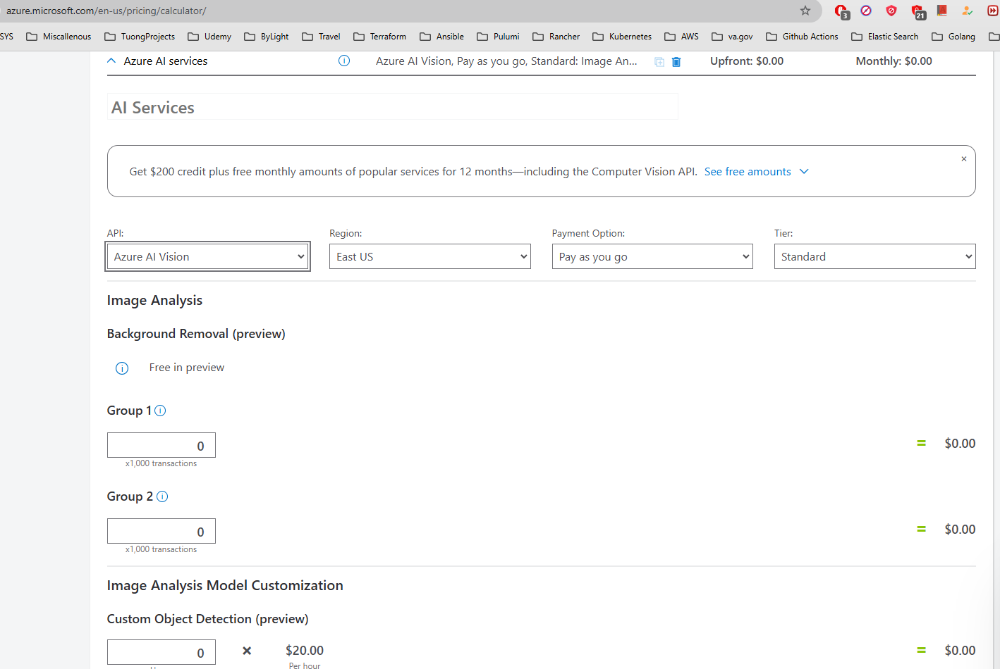
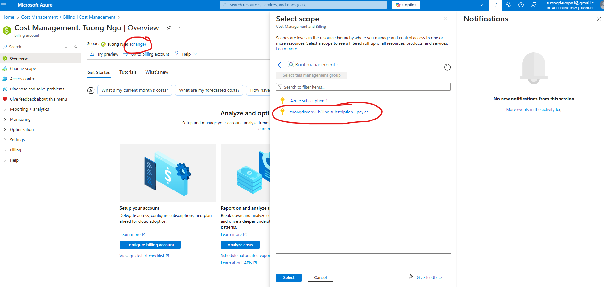
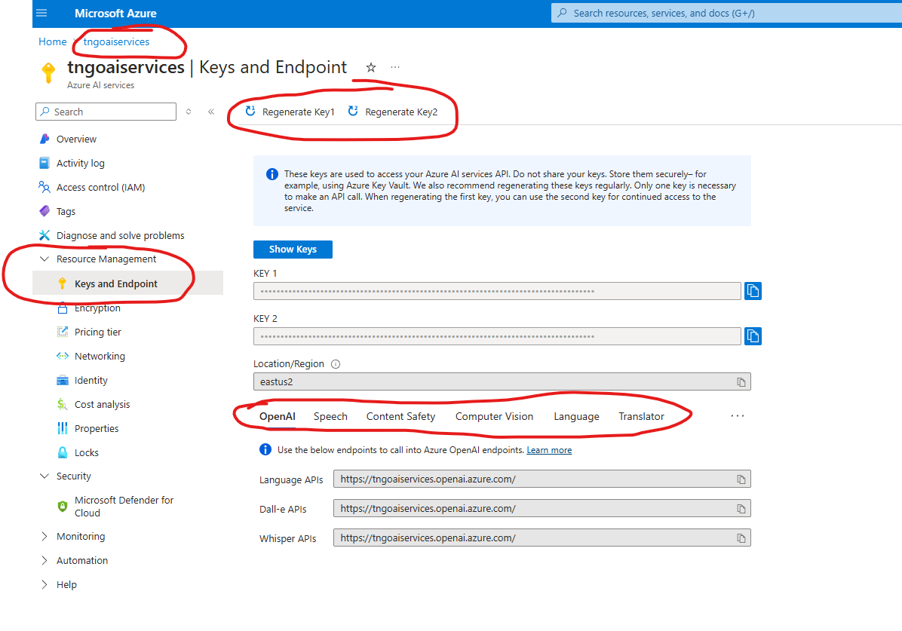
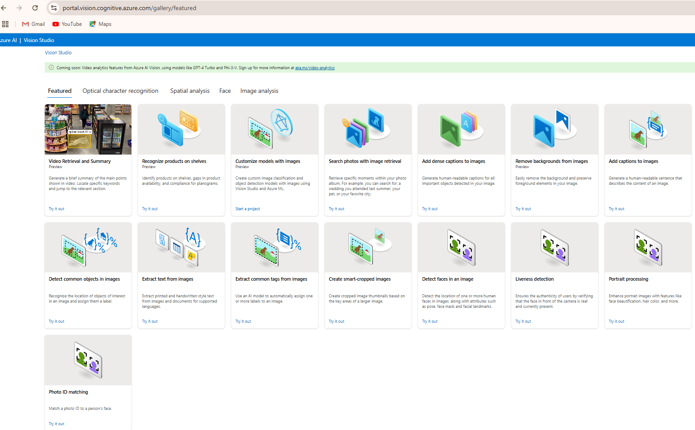
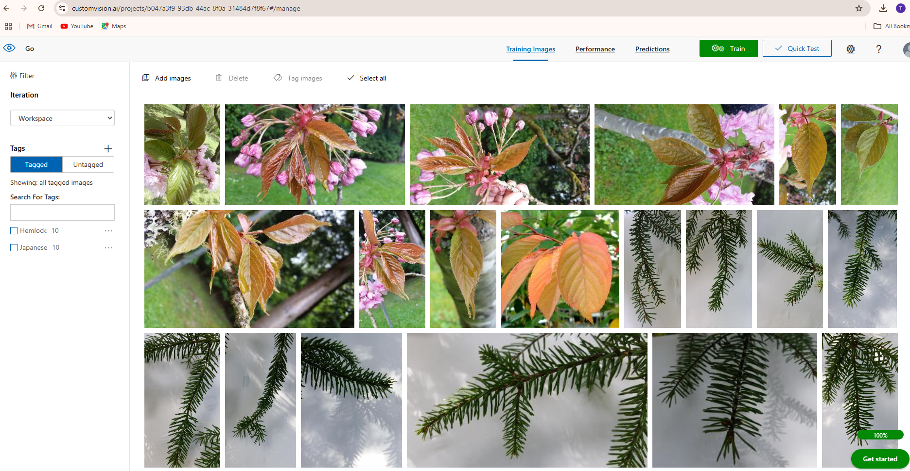

<h1 style="color:pink; font-family:cursive; font-weight:bold; text-align:center;">Azure AI Engineer Associate  Tuong Ngo</h1>

- **REST API Reference**: https://learn.microsoft.com/en-us/rest/api/aiservices/?view=rest-customvision-v3.4-preview

<h1 style="color:blue; font-family:cursive; font-weight:bold; text-align:left;">Plan, create and deploy and Azure AI Service</h1>

## Six Principles Should Guide AI Development
- Fairness
- Reliability and safety
- Privacy and security
- Inclusive
- Transparency
- Accountability
## Azure AI Services CI/CD
- Apply to Custom Models
  - Custom vision
  - Custom Speech
  - Conversation AI - bots
  - Custom Document Intelligence
- When creating a custom model, need to split data into `training data` and `testing data`
- When you have new or more `testing data`, the CI workflow recalculates the error rate for the new data
When you have new `training data`, the model is re-trained on that data -> basically a brand new data is created
  - You can rerun the new model under your test
  - If new model does **not** improve on the old model (`error rate`), then stop
  - If improves on the old ones (`error rate`), deploy it
    - May want to have manual approval so that teams are on standby for changes to production
    - Check out `Speech Services DevOps Template` for sample

## Azure AI Services Container Deployment - such as in K8s
- Reference: https://learn.microsoft.com/en-us/azure/ai-services/cognitive-services-container-support
- Can deploy **some** of AI Services in Containers to be run On-Premise. Some container services support offline use which are subjected to MSFT approval.
- AI Services are priced "per call" so that data for such billing is still collected/sent but your own data aren't sent to the internet to the cloud.

### Benefits of containerzed AI
- Immutable infrastructure: complete control of hardware running the container
- Control over data
- Control over model updates
- Portable infrastructure
- High throughput / low latency
- Scalability

### Decision Services that Support Containers
- Anomaly Detector

### Language Services that Support Containers
- LUIS
- Key phrase extraction
- Language detection
- Sentiment analysis
- Named entity recognition
- Summarization
- Translation

### Speech Services that Support Containers
- Speech to text
- Custom Speech to text
- Language identification

<h1 style="color:blue; font-family:cursive; font-weight:bold; text-align:left;">Manage, monitor, and secure an Azure AI service</h1>

## Configure diagnostic logging
- After creation of AI services resource group
- Go to that resource group -> Diagnostic settings
  - Audit logs
  - Request and Response Logs
  - Trace Logs
  - All Metrics (memory + CPU usages)
- If Destination is "Log Analycis workspace" -> Logs are sent to centralized "Monitor" workspace where we can perform various operation such as analysis over the logs
- It takes some time for the logs to be sent to Monitor's Logs|Metrics
- Monitor -> Metrics -> Choose scope (resource group of AI service)
  - Metrics include Successful Calls, RateLimit, Latency, Server Errors, etc...
- Monitor -> Logs -> Close out Queries page popped up -> Under New Query 1 tab ->  Pull out Tables listing -> Select scope -> Choose resource group of AI service
  - Query language used is `Kusto Query Language`
### Another way of turning on disagnostic logging
- Monitor -> Diagnotic settings -> Choose resouce that needs to have diagnostic enabled

## Managed Cost for Azure AI Services
- Reference: https://azure.microsoft.com/en-us/pricing/details/cognitive-services/
- Pricing is different from Regions, Currencies
- Calculator: https://azure.microsoft.com/en-us/pricing/details/cognitive-services/calculator
  - Choose AI Services -> Choose API -> Choose Tier
  

- To view cost: Home -> Cost Management + Billing -> Cost Management -> Cost Analysis -> Select scope -> pay as you go

  - Accumulated cost -> Can change scope to specific resource group or even at the subscription level
  - Accumulated cost -> Can view to `dailyCosts`, `monthlyCosts`, etc...
  - Accumulated cost -> Can change time period

## Manage Account Keys
- Resource group -> Resource of AI Service -> Resource Management ->  Key and Endpoint

- You'll need the key + the endpoint of the service to pass into your service code

## Protect account keys by using Azure Key Vault
- Key Vault is solution for the secure handling of secrets, including keys for AI Services
- Perform role assignment with role "Key Vault Administrator" to your self
- Go to `Secrets` tab -> Generate/Import -> Give the name to the Secret -> Copy content from AI Key and paste into the secret
- Modify the code to retrieve the key from here

### TODO
- Assignment: Official MS Learn Labs

<h1 style="color:blue; font-family:cursive; font-weight:bold; text-align:left;">Create Solutions For Content Delivery</h1>

### Azure AI Content Safety
Reference: https://contentsafety.cognitive.azure.com
- Monitor content generated by both foundation models and humans
- Defect and filter violence, hate, sexual and self-harm content
- Monitor text, images and multimodel content

## Text Moderation With Azure AI Content Safety
- Hate & Fairness
- Sexual
- Violence
- Self-harm

- Controller of this
  - Define severity thresholds for each category

## Image Moderation
- Hate & Fairness
- Sexual
- Violence
- Self-harm

<h1 style="color:blue; font-family:cursive; font-weight:bold; text-align:left;">Analyze images</h1>

- Resource: `Computer Vision`

## Azure AI Vision Services Overview
- Select visual features to meet image processing requirements
- Detect objects in images and generate image tags
- Include image analysis features in an image processing request
- Interpret image processing responses
- Extract text from images using Azure AI Vision
- Convert handwritten text using Azure AI Vision

## Image analysis
- API Version v4.0:  `azure.ai.vision.imageanalysis`
  - Read text
  - Captions
  - Dense captions
  - Tags
  - Object detection
  - Custom image classification / object detection
  - People
  - Smart crop
- Image Requirement v4.0:
  - JPG, PNG, GIF, BMP, WEBP, ICO, TIFF or MPO
  - Less than 20MB
  - Greater than 50x50 pixels
  - Less than 10000 x 1000 pixcels for OCR

## Detect Objects & Generate Tags
- Difference between Objects and Tags
  - Objects are actual physical items seen, provides their locations, identifies relationships and repetitions
  - Tags include both items seen and theme, i.e. a person jumping with a skateboard can have tags generated with: sport, street stunts, balance, skateboarding, ...
- Both Objects & Tags are both generated with % of confidence
- You can change the level of confidence to have objects & tags with higher confidence level to show up in a result

## Interpret image processing reponses
- API Reference: https://learn.microsoft.com/en-us/azure/ai-services/computer-vision/how-to/call-analyze-image-40?pivots=programming-language-rest-api
- Can generate caption, tags and object from an image via azure-ai-vision-imageanalysis python package code
- Multiple functions/calls are used, each incur a charge
- Refer to image_analysis.py file in azure-labs.git Tuong private repo

## Extract text from images using Azure AI Vision
- API Reference: https://learn.microsoft.com/en-us/azure/ai-services/computer-vision/how-to/call-read-api
- Use the Read API to extract printed and handwritten text in supported languages from images, PDFs, and TIFF files. The optical character recognition (OCR) capability supports both images and documents with mixed languages, and doesn't require specifying the language.
- Refer to image_analysis.py file in azure-labs.git Tuong private repo

<h1 style="color:blue; font-family:cursive; font-weight:bold; text-align:left;">Implement custom computer vision models</h1>

- Resource: `Custom Vision`

- **Important**: Only East US, West US 2, support Computer Solution at the time of writing

## Choose between image classification and object detection models
- `Custom vision service` enables you to create and train personalized models by assigning your own labels for image recognition.
  - `Image Classification`: Assigns labels to entire images
    - Ideal for categorizing photos into predefined classes
  - `Object detection`: Identifies and locates objects within images
    - Suitable for scenarios where the location of the object is important

## Creating, Training, Using Custom Image Model via Custom Vision
- Step by step handon for building, training, prediction consumption of `model customization`: https://learn.microsoft.com/en-us/azure/ai-services/Custom-Vision-Service/getting-started-build-a-classifiermodel-customization?tabs=studio
- Build programatically with Go [**outdated**]: https://learn.microsoft.com/en-us/azure/ai-services/custom-vision-service/quickstarts/image-classification?tabs=windows%2Cvisual-studio&pivots=programming-language-go
  - Custom Vision home to obtain settings of resources: https://www.customvision.ai/
- REST API Reference: https://learn.microsoft.com/en-us/rest/api/custom-vision/?view=rest-customvision-v3.4-preview

- Run `go run sample.go` under `azure_labs.git/custom_vision` from Tuong private repo

- Other API resources:
  - [API for creating project](https://learn.microsoft.com/en-us/rest/api/customvision/create-project/create-project?view=rest-customvision-v3.4-preview&tabs=HTTP)
  - [Getting project](https://learn.microsoft.com/en-us/rest/api/customvision/get-projects/get-projects?view=rest-customvision-v3.4-preview&tabs=HTTP)
  - [Train](https://learn.microsoft.com/en-us/rest/api/customvision/train-project/train-project?view=rest-customvision-v3.4-preview&tabs=HTTP)
  - [Publishing iteration](https://learn.microsoft.com/en-us/rest/api/customvision/publish-iteration/publish-iteration?view=rest-customvision-v3.4-preview&tabs=HTTP)
  - [Test image](https://learn.microsoft.com/en-us/rest/api/customvision/quick-test-image/quick-test-image?view=rest-customvision-v3.4-preview&tabs=HTTP)
  - [Query prediction](https://learn.microsoft.com/en-us/rest/api/customvision/query-predictions/query-predictions?view=rest-customvision-v3.4-preview&tabs=HTTP)
  - [Creating images from files](https://learn.microsoft.com/en-us/rest/api/customvision/create-images-from-files/create-images-from-files?view=rest-customvision-v3.4-preview&tabs=HTTP)

<h1 style="color:blue; font-family:cursive; font-weight:bold; text-align:left;">Analyze Videos</h1>

- Resource: `Computer Vision`

## Use Azure AI Video Indexer to extract insights
- Extract `insights` from videos
  - Transcripts
  - OCR elements
  - Faces
  - Topics
  - Audio effects detection
  - Text-basd emotion detection
  - and more...

## Use Azure AI Vision Spacial Analysis to detect presence and movement
- Examining the objects in the video and the relationship with each other
- Monitor people's presence and movements in video streams
- `Video Retrieval` of parts of videos that fits query description and `Summary` of videos
- Detect when people cross a line
- Detect when people enter/exit a zone
- Monitor social distancing

### Video Retrieval API Resources
- [API How-To](https://learn.microsoft.com/en-us/azure/ai-services/computer-vision/how-to/video-retrieval)
- [REST API Reference](https://learn.microsoft.com/en-us/azure/ai-services/computer-vision/reference-video-search)
- **Note**: Can't use the service nor its APIs unless you go with paid account

<h1 style="color:blue; font-family:cursive; font-weight:bold; text-align:left;">Implement Natural Language Processing Solutions</h1>

<h2 style="color:blue; font-family:cursive; font-weight:bold; text-align:left;">Analyze Text</h2>

## Key Phrase Extraction

- [REST API Reference](https://learn.microsoft.com/en-us/rest/api/language/text-analysis-runtime/analyze-text?view=rest-language-2024-11-01&tabs=HTTP)

- Identifies the main concepts and phrases from text, providing insights into its primary themes and topics
- 3 ways to use:
  - Language Studio
  - REST API
  - Container

- The more text provided, the better extraction of key phases such as topics, themes, etc...
- Use `key phrase extraction` to quickly identify the main concepts in text. For example, in the text "The food was delicious and the staff were wonderful.", `key phrase extraction` will return the main topics: "food" and "wonderful staff".

## Entity linking

- [REST API Reference](https://learn.microsoft.com/en-us/rest/api/language/text-analysis-runtime/analyze-text?view=rest-language-2024-11-01&tabs=HTTP)

- `Entity linking` identifies and disambiguates the identity of entities found in text. For example, in the sentence "We went to Seattle last week.", the word "Seattle" would be identified, with a link to more information on Wikipedia.

## Named Entity Recognition (NER)

- [REST API Reference](https://learn.microsoft.com/en-us/rest/api/language/text-analysis-runtime/analyze-text?view=rest-language-2024-11-01&tabs=HTTP)

- The `NER` feature can identify and categorize entities in unstructured text.
- **For example**: people, places, organizations, and quantities. The prebuilt NER feature has a pre-set list of recognized entities. The custom NER feature allows you to train the model to recognize specialized entities specific to your use case.

## Text Analytics for Health

- [REST API Reference](https://learn.microsoft.com/en-us/rest/api/language/text-analysis-runtime/analyze-text?view=rest-language-2024-11-01&tabs=HTTP)

- `Text Analytics for health` is a cloud-based API service that applies machine-learning intelligence to extract and label relevant medical information from a variety of unstructured texts such as doctor's notes, discharge summaries, clinical documents, and electronic health records.
- **Usage scenarios**:
  - Assisting and automating the processing of medical documents by proper medical coding to ensure accurate care and billing.
  - Increasing the efficiency of analyzing healthcare data to help drive the success of value-based care models similar to Medicare.
  - Minimizing healthcare provider effort by automating the aggregation of key patient data for trend and pattern monitoring.
  - Facilitating and supporting the adoption of HL7 standards for improved exchange, integration, sharing, retrieval, and delivery of electronic health information in all healthcare services.

## Custom Named Entity Recognition (NER)

- [REST API Reference](https://learn.microsoft.com/en-us/rest/api/language/text-analysis-runtime/analyze-text?view=rest-language-2024-11-01&tabs=HTTP)

- `Custom NER` is a cloud-based API service that applies machine-learning intelligence to enable you to build custom models for custom named entity recognition tasks.
- `Custom NER` enables users to build custom AI models to extract domain-specific entities from unstructured text, such as contracts or financial documents.
- By creating a `Custom NER project`, developers can iteratively label data, train, evaluate, and improve model performance before making it available for consumption. The quality of the labeled data greatly impacts model performance.
- To simplify building and customizing your model, the service offers a custom web portal that can be accessed through the Language studio.
- **Example usage scenarios**:
  - **Information extraction**: Automate data extraction from complex, unstructured text sources like bank statements and legal agreements.
  - **Knowledge mining**: Enhance search experiences by extracting relevant entities from text to enrich indexing.
  - **Audit and compliance**: Automate the review of long text files to enforce compliance policies and set up business rules.
- **Project development lifecycle**:
  - Define your schema: Identify the entities you want extracted.
  - Label your data: Label precisely, consistently, and completely.
  - Train the model: Your model learns from your labeled data.
  - View the model's performance: Evaluate and improve the model.
  - Deploy the model: Make it available for use via the Analyze API.
  - Extract entities: Use your custom models for entity extraction tasks.
